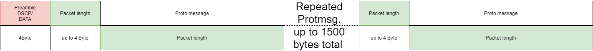
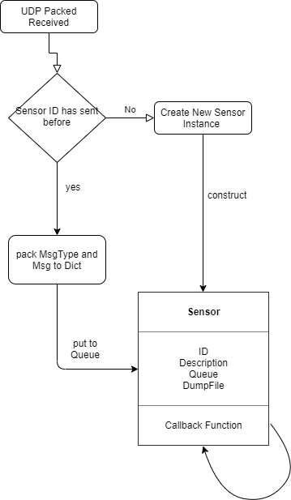
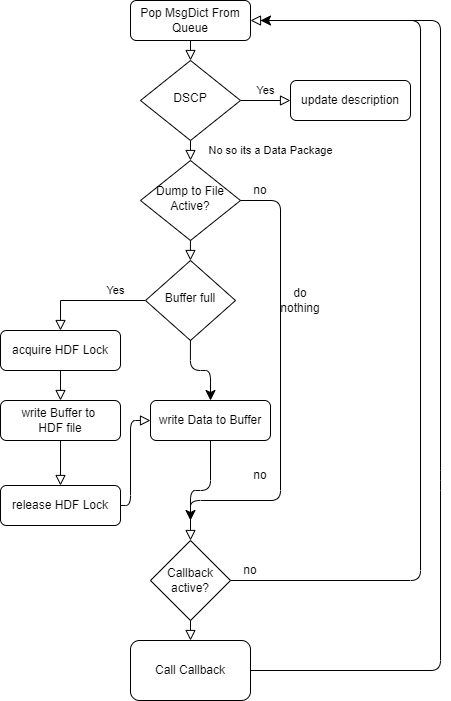

# Met4FoF Datareceiver
This reposity contains the software needed to receive the measurement data from the Met4FoF Smartup unit.
# Installation
1. clone this repo
2. install dependencies
```
pip install -r requirements.txt
```

# Usage
## With a Met4FoF Data Aqusition unit
1. Set the Ip address of your PC to the UDP target IP address shown on the board, which is probably ```192.168.0.200```.
2. Create an DataReceiver instance bound to your UDP Target IP
    ```python
    DR = DataReceiver("192.168.0.200", 7654)
    ``` 
   
    After some time you should see output like this 
   
# Principle of Operation
## Data format
The data sent by the smartup unit is serialized with [google protobuff](https://developers.google.com/protocol-buffers).
Two different protobuff [messages](https://github.com/Met4FoF/Met4FoF-SmartUpUnit/blob/SSU_V2/protobuff_deps/messages.proto) are used.
1. DataMessage:
```protobuf
message DataMessage {
  required uint32 id = 1;               //32 Bit ID of the sensor                         [0x1FE40100]
  required uint32 sample_number = 2;    //32 Inger number of samples sent                 [1000]
  required uint32 unix_time = 3;        //Measurement data timestamp unix seconds         [1586940213]-->2020-04-15T08:43:33+00:00 in ISO 8601
  required uint32 unix_time_nsecs = 4;  //Measurement data timestamp nanosecond fraction  [123456]------>2020-04-15T08:43:33.000123456
  required uint32 time_uncertainty = 5; //uncertainty of time stamp in nanoseconds        [150]--------->2020-04-15T08:43:33.000123456+-0.000000150  
  required float Data_01 =6;            //Data of 1st channel as float number             [9.81]
  optional float Data_02 =7;            //Data of 2nd channel as float number
  optional float Data_03 =8;            //Data of 3rd channel as float number            
  optional float Data_04 =9;            //Data of 4th channel as float number
  optional float Data_05 =10;           //Data of 5th channel as float number
  optional float Data_06 =11;           //Data of 6th channel as float number
  optional float Data_07 =12;           //Data of 7th channel as float number
  optional float Data_08 =13;           //Data of 8th channel as float number
  optional float Data_09 =14;           //Data of 9th channel as float number
  optional float Data_10 =15;           //Data of 10th channel as float number
  optional float Data_11 =16;           //Data of 11th channel as float number
  optional float Data_12 =17;           //Data of 12th channel as float number
  optional float Data_13 =18;           //Data of 13th channel as float number
  optional float Data_14 =19;           //Data of 14th channel as float number
  optional float Data_15 =20;           //Data of 15th channel as float number
  optional float Data_16 =21;           //Data of 16th channel as float number
}
```
With this message the measured values of the sensors are transmitted. The TimeStamp is valid globally for all channels.
In this format, the measurement data are passed on by the data receiver in callback of the sensor class.
2. Description messages
```protobuf
message DescriptionMessage {
  required uint32 id = 1;                                   //32 Bit ID of the sensor     [0x1FE40100]
  required string Sensor_name = 2 [(nanopb).max_size = 40]; //Name of the Sensor          [MPU 9250]
  enum  DESCRIPTION_TYPE{
  PHYSICAL_QUANTITY = 0;                                   //Sting fields describe the unit of the measured values
  UNIT = 1;                                                //Sting fields describe the unit of the measured values in DSI Format https://gitlab1.ptb.de/d-ptb/d-si/xsd-d-si
  UNCERTAINTY_TYPE = 2;                                    // RESERVED
  RESOLUTION = 3;                                          // Float field contains the number of steps between Min and Max Value eg [256] for an 8 bit Sensor or [1024] for an 10 bit sensor
  MIN_SCALE = 4;                                           // Float field contains the maximal possible value for an data channel
  MAX_SCALE = 5;                                           // Float field contains the minmal possible value for an data channel
  }
  required DESCRIPTION_TYPE Description_Type =3;
  optional string str_Data_01 =4 [(nanopb).max_size = 40];
  optional string str_Data_02 =5 [(nanopb).max_size = 40];
  optional string str_Data_03 =6 [(nanopb).max_size = 40];
  optional string str_Data_04 =7 [(nanopb).max_size = 40];
  optional string str_Data_05 =8 [(nanopb).max_size = 40];
  optional string str_Data_06 =9 [(nanopb).max_size = 40];
  optional string str_Data_07 =10 [(nanopb).max_size = 40];
  optional string str_Data_08 =11 [(nanopb).max_size = 40];
  optional string str_Data_09 =12 [(nanopb).max_size = 40];
  optional string str_Data_10 =13 [(nanopb).max_size = 40];
  optional string str_Data_11 =14 [(nanopb).max_size = 40];
  optional string str_Data_12 =15 [(nanopb).max_size = 40];
  optional string str_Data_13 =16 [(nanopb).max_size = 40];
  optional string str_Data_14 =17 [(nanopb).max_size = 40];
  optional string str_Data_15 =18 [(nanopb).max_size = 40];
  optional string str_Data_16 =19 [(nanopb).max_size = 40];
  optional float f_Data_01 =20;
  optional float f_Data_02 =21;
  optional float f_Data_03 =22;
  optional float f_Data_04 =23;
  optional float f_Data_05 =24;
  optional float f_Data_06 =25;
  optional float f_Data_07 =26;
  optional float f_Data_08 =27;
  optional float f_Data_09 =28;
  optional float f_Data_10 =29;
  optional float f_Data_11 =30;
  optional float f_Data_12 =31;
  optional float f_Data_13 =32;
  optional float f_Data_14 =33;
  optional float f_Data_15 =34;
  optional float f_Data_16 =35;
}
```
For a further insight into the Description Messages we recommend a look at function
```c++
int MPU9250::getDescription(DescriptionMessage * Message,DescriptionMessage_DESCRIPTION_TYPE DESCRIPTION_TYPE)
```
of the [MPU9250 in the driver](https://github.com/Met4FoF/Met4FoF-SmartUpUnit/blob/SSU_V2/Src/MPU9250.cpp)

### Data structure in UDP messages.

Protobuff does not encode the message type into binary format. This must be transmitted differently or must always be the same by the software layout.
The smartup unit transmits the data type as a 4 byte ASCI encoded keyword at the beginning of each packet of messages.
The keywords are ```DSCP``` for descriptions and ```DATA``` for data messages
Udp packets can usually transfer a payload of up to 1500 bytes in length. To save network resources and microcontroller processing time the protbuff messages are packed.  The length of each message is encoded as varint32 before the messages.


### UDP Data processing by Datareceiver


As soon as the datareiceiver has been started all messages arriving on the network interface of the receiver are processed continuously. The messages are unpacked and deserialized. Then the sensor ID is read from the message. If ID this is unknown, a new sensor class instance (and therefore also a new task) is spwand and added to the list of known sensors ```DataReceiver.Allsensors```. In any case the message will be sent to the SensorTask via the [multiprocessing.queue](https://docs.python.org/2/library/multiprocessing.html) in a Dict with the type of the message

### Dataprocessing with in the sensor task

The Sensor Task continuously pops message dicts from the queue. Description messages are used to update the sensor description of the sensor instance.
If one of the flags "DumpToFileASCII" or "DumpToFileProto" is set, the corresponding dump file is opened. Afterwards every message is written into the file until the flag is removed. If a callback is set it will be called with the description and the message. See the section callback. TODO Callback Section 
## Additional information

Additional information around code writing and software development in the project you can find in the repository's [wiki](https://github.com/Met4FoF/Code/wiki), in the [coding conventions](conventions/README.md) and in our related [Blog post](https://www.ptb.de/empir2018/met4fof/information-communication/blog/detail-view/?tx_news_pi1%5Bnews%5D=38&tx_news_pi1%5Bcontroller%5D=News&tx_news_pi1%5Baction%5D=detail&cHash=ce963c7573572d40ef0f496449ef8aff) on the [project homepage](https://www.ptb.de/empir2018/met4fof/home/).
